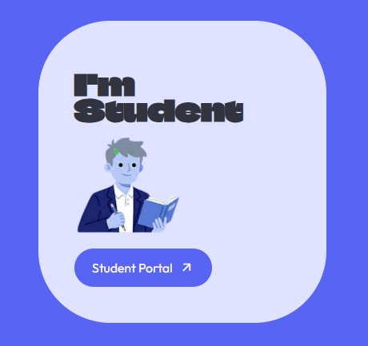
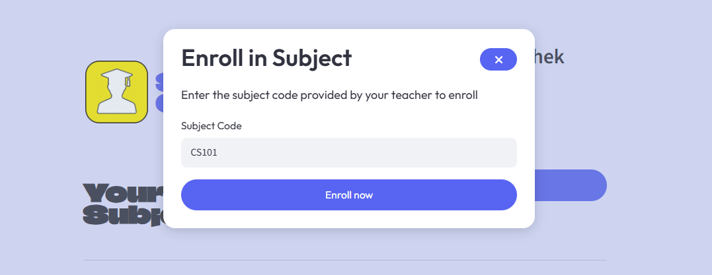
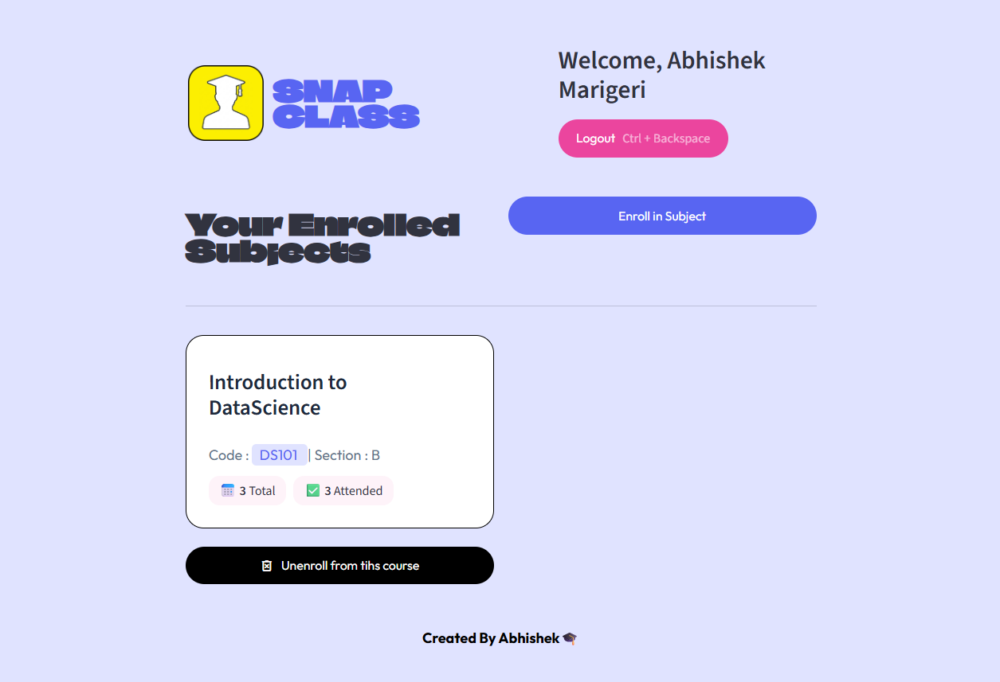
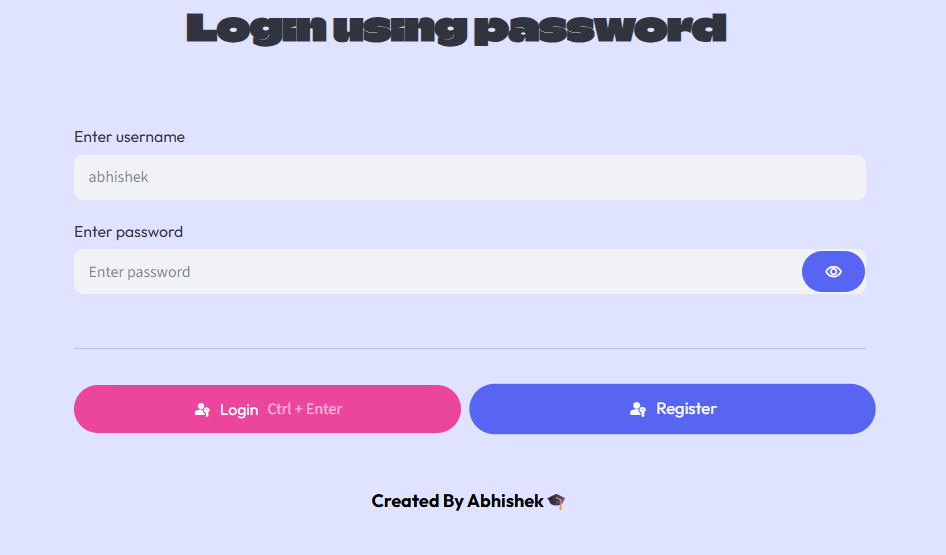
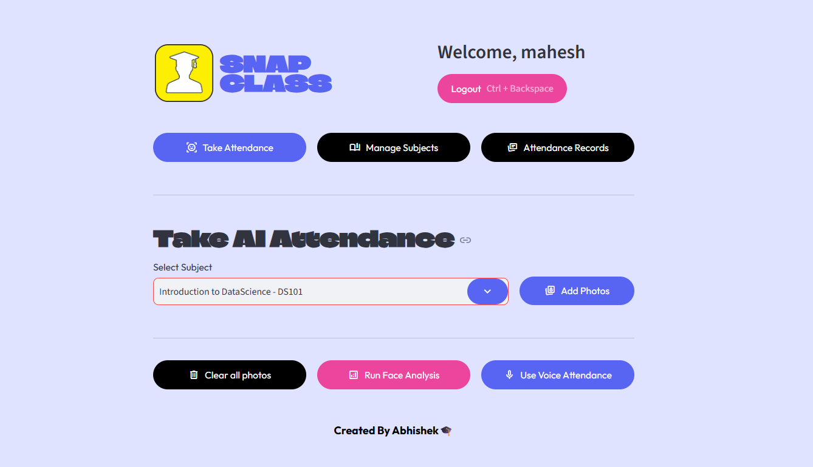
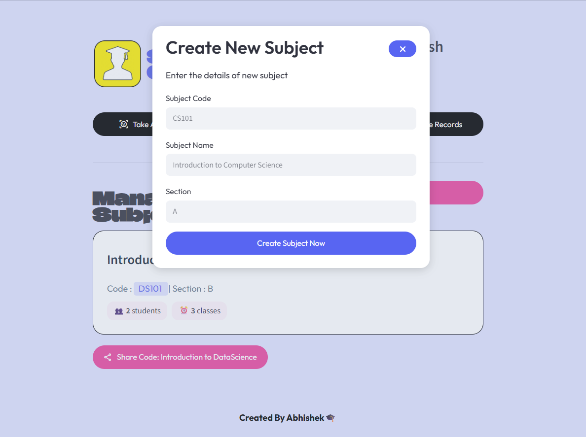
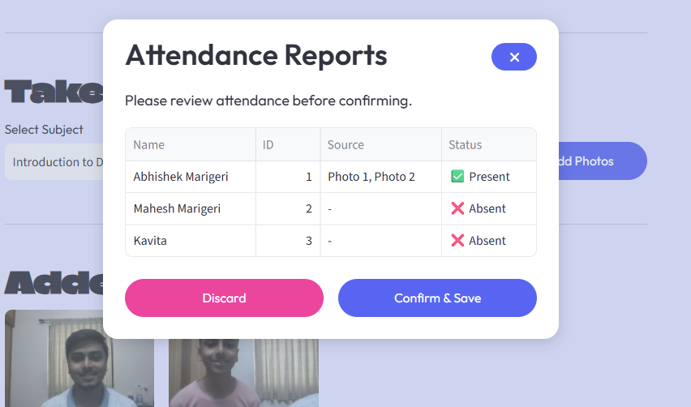
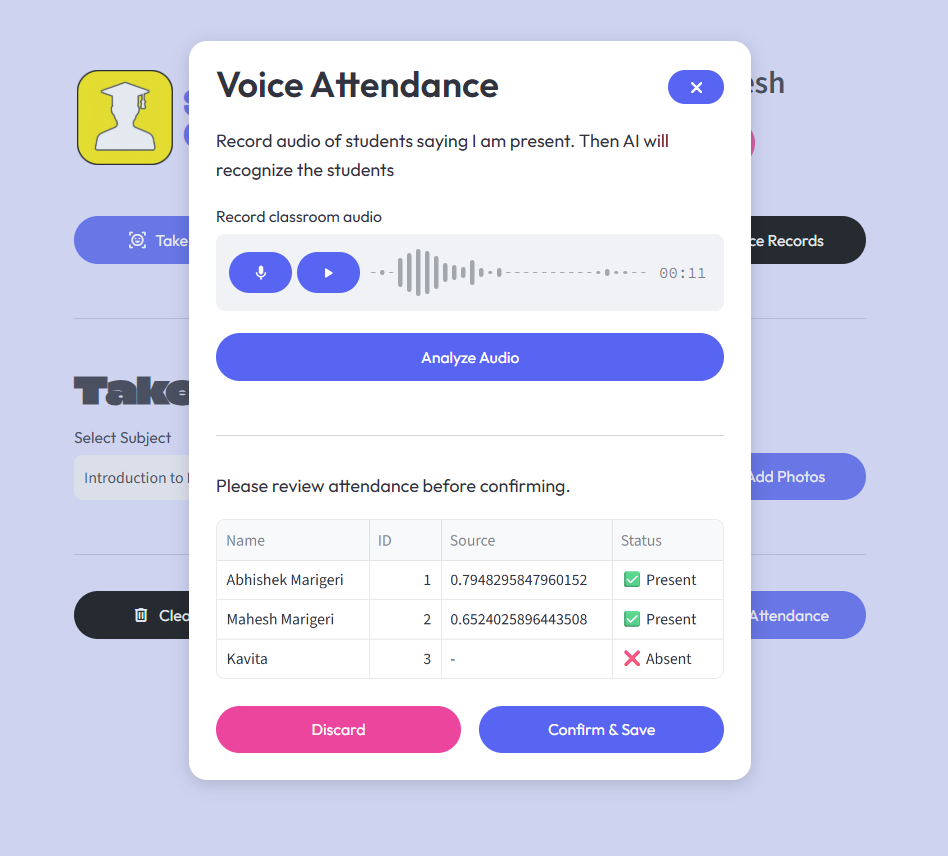

<div align="center">

# 🎓 SNAPCLASS
### AI-Powered Smart Attendance Management System

<p align="center">

An intelligent attendance management platform that automates classroom attendance using **Face Recognition**, **Voice Recognition**, **QR Code Enrollment**, and **Artificial Intelligence**.

</p>


<br>


</div>

---

# 🌟 Overview

SNAPCLASS is an AI-powered attendance management platform that automates classroom attendance using **Computer Vision**, **Machine Learning**, and **Speaker Recognition**.

The system enables teachers to create and manage subjects, share QR codes for enrollment, and record attendance using classroom photos or voice recordings. Students can securely enroll in subjects, register their facial data, and monitor attendance through an intuitive dashboard.

---

## 🚀 Live Demo

| Application | Link |
|-------------|------|
| 🌐 Landing Page |https://snap-class-landing-page-bice.vercel.app/ |
| 🎯 Streamlit App | https://snapclass-7696-main.streamlit.app/ |


---

# ✨ Key Features

### 👨‍🏫 Teacher

- Secure Authentication
- Create & Manage Subjects
- QR Code Generation
- Subject Share Link
- AI Face Attendance
- AI Voice Attendance
- Attendance Reports

### 👨‍🎓 Student

- Secure Login
- Face Registration
- QR Enrollment
- Subject Code Enrollment
- Attendance Dashboard
- Attendance History

### 🤖 AI

- Face Detection
- Face Recognition
- Voice Recognition
- SVM Classification
- 128-D Face Embeddings
- Automatic Attendance Logging

# 📚 Table of Contents

- [📖 Overview](#-overview)
- [✨ Key Features](#-key-features)
- [🏗️ System Architecture](#️-system-architecture)
- [🛠️ Technology Stack](#️-technology-stack)
- [📂 Project Structure](#-project-structure)
- [🗄️ Database Design](#️-database-design)
- [🤖 Face Recognition Pipeline](#-face-recognition-pipeline)
- [🎤 Voice Recognition Pipeline](#-voice-recognition-pipeline)
- [📸 Application Demo](#-application-demo)
- [⚙️ Installation](#️-installation)
- [☁️ Deployment](#️-deployment)
- [🚀 Future Improvements](#-future-improvements)
- [👨‍💻 Author](#-author)

---

# 🏗️ System Architecture

```text
                           ┌──────────────────────┐
                           │      Teacher         │
                           └──────────┬───────────┘
                                      │
                                      ▼
                         Streamlit Web Application
                                      │
          ┌───────────────────────────┼───────────────────────────┐
          ▼                           ▼                           ▼
   Face Recognition            Voice Recognition         Subject Management
          │                           │                           │
          ▼                           ▼                           ▼
   Face Embeddings            Speaker Embeddings          QR Enrollment
          │                           │                           │
          └───────────────┬───────────┴───────────────┬───────────┘
                          ▼                           ▼
                  Attendance Engine          Supabase Database
                          │
                          ▼
                 Attendance Dashboard
```

---

# 🛠️ Technology Stack

## 💻 Frontend

| Technology | Purpose |
|------------|----------|
| Streamlit | Web Application |
| HTML | UI Components |
| CSS | Styling |
| JavaScript | Interactive Features |

---

## ⚙️ Backend

| Technology | Purpose |
|------------|----------|
| Python | Backend Logic |
| Supabase | Cloud Database |
| bcrypt | Password Hashing |

---

## 🤖 Artificial Intelligence

| Technology | Purpose |
|------------|----------|
| OpenCV | Image Processing |
| Dlib | Face Detection |
| face_recognition | Face Embeddings |
| Scikit-Learn | SVM Face Classification |
| Librosa | Audio Processing |
| Resemblyzer | Voice Recognition |

---

## ☁️ Deployment

| Platform | Purpose |
|-----------|----------|
| Streamlit Community Cloud | AI Attendance System |
| Vercel | Landing Website |
| GitHub | Version Control |

---

# 📂 Project Structure

```text
SNAPCLASS
│
├── .streamlit/
│   ├── config.toml
│   └── secrets.toml
|
├── src/
│   ├── components/
│   ├── database/
│   ├── pipelines/
│   ├── screens/
│   ├── ui/
│   ├── utils/
│   └── models/
│
├── app.py
├── requirements.txt
├── runtime.txt
└── README.md
```

---

# 🗄️ Database Design

The application uses **Supabase (PostgreSQL)** as the cloud database.

### Main Tables

| Table | Description |
|--------|-------------|
| teachers | Teacher accounts |
| students | Student accounts |
| subjects | Subject information |
| subject_students | Student enrollment |
| attendance_logs | Attendance records |

---

## 🔄 Workflow

```text
Teacher
    │
Creates Subject
    │
Shares QR Code
    │
Student Joins
    │
Registers Face
    │
Teacher Uploads Images / Audio
    │
AI Identifies Students
    │
Attendance Stored in Supabase
    │
Dashboard Updated
```

---
# 📸 Application Demo

This section showcases the complete workflow of SNAPCLASS for both **Students** and **Teachers**, demonstrating how Artificial Intelligence automates attendance management.

---

# 👨‍🎓 Student Workflow

## 1️⃣ Student Home

Students can register, log in, or use facial authentication to access their dashboard.

<p align="center">

</p>

---

## 2️⃣ Student Login

Students securely authenticate using their registered username and password.

<p align="center">

</p>

---

## 3️⃣ Subject Enrollment

Students can instantly enroll in a course by entering the subject code or scanning the QR code shared by the teacher.

<p align="center">

</p>

### Features

- QR Code Enrollment
- Subject Code Enrollment
- Duplicate Enrollment Detection
- Instant Enrollment

---

## 4️⃣ Student Dashboard

After enrollment, students can view all registered subjects and monitor their attendance records.

<p align="center">

</p>

Dashboard Features

- Enrolled Subjects
- Attendance Statistics
- Attendance Percentage
- Subject Details
- Unenroll Option

---

# 👨‍🏫 Teacher Workflow

## 1️⃣ Teacher Home

Teachers can register or securely log into the platform.

<p align="center">

</p>

---

## 2️⃣ Teacher Login

Teachers authenticate using encrypted credentials stored securely in Supabase.

<p align="center">

</p>

---

## 3️⃣ Teacher Dashboard

The dashboard provides an overview of all created subjects and attendance statistics.

<p align="center">

</p>

Dashboard Features

- Subject Management
- Student Count
- Attendance Reports
- QR Code Sharing

---

## 4️⃣ Create Subject

Teachers can create new subjects by providing the course name and section.

<p align="center">

</p>

Features

- Auto-generated Subject Code
- Section Management
- Cloud Storage
- Instant Availability

---

## 5️⃣ Share Subject

Each subject automatically generates a unique QR Code and subject code for quick student enrollment.

<p align="center">

</p>

Students can

- Scan QR Code
- Click Share Link
- Enter Subject Code

---

# 🤖 AI Attendance System

SNAPCLASS supports two attendance modes powered by Artificial Intelligence.

---

## 📷 Face Recognition Attendance

Teachers upload classroom photographs.

The system

- Detects Faces
- Extracts Facial Embeddings
- Matches Students
- Marks Attendance Automatically

<p align="center">

</p>

---

## 🎤 Voice Recognition Attendance

Teachers upload classroom voice recordings.

The AI system

- Splits Audio
- Generates Speaker Embeddings
- Identifies Speakers
- Marks Attendance

<p align="center">

</p>

---

# 📊 Attendance Reports

Attendance records are automatically stored in Supabase and displayed inside the dashboard.

<p align="center">

</p>

The report includes

- Present Students
- Absent Students
- Attendance History
- Date & Time
- Subject-wise Attendance

---

# ⚡ Complete Workflow

```text
Teacher Creates Subject
          │
          ▼
Share QR Code / Subject Code
          │
          ▼
Student Enrolls
          │
          ▼
Student Registers Face
          │
          ▼
Teacher Uploads Images / Audio
          │
          ▼
AI Detects Student Identity
          │
          ▼
Attendance Logged in Supabase
          │
          ▼
Dashboard Updated Instantly
```

---

# 🎯 Key Capabilities

✅ AI-based Attendance Automation

✅ Face Recognition using Dlib & Face Recognition

✅ Voice Recognition using Resemblyzer

✅ QR-based Student Enrollment

✅ Secure Teacher & Student Authentication

✅ Cloud Database using Supabase

✅ Attendance Reports & Analytics

✅ Streamlit Cloud Deployment

✅ Vercel Landing Page

---
# 🤖 Face Recognition Pipeline

SNAPCLASS uses **Computer Vision** and **Machine Learning** to automatically recognize students from classroom images.

## Workflow

```text
Classroom Image
       │
       ▼
Face Detection (Dlib)
       │
       ▼
Face Landmark Detection
       │
       ▼
128-D Face Embedding Generation
       │
       ▼
SVM Classifier
       │
       ▼
Student Identification
       │
       ▼
Attendance Decision
       │
       ▼
Supabase Database
```

### Face Recognition Process

1. Detect all faces in the uploaded classroom image.
2. Generate a **128-dimensional facial embedding** for each detected face.
3. Compare embeddings against registered student embeddings.
4. Predict the student identity using an **SVM classifier**.
5. Verify prediction using an embedding distance threshold.
6. Mark attendance automatically.
7. Store attendance records in Supabase.

---

# 🎤 Voice Recognition Pipeline

SNAPCLASS also supports **voice-based attendance** using speaker recognition.

## Workflow

```text
Audio Recording
      │
      ▼
Noise Reduction
      │
      ▼
Voice Segmentation
      │
      ▼
Speaker Embeddings
      │
      ▼
Cosine Similarity
      │
      ▼
Speaker Identification
      │
      ▼
Attendance Logging
```

### Voice Recognition Process

1. Upload classroom audio.
2. Split audio into speech segments.
3. Generate speaker embeddings using **Resemblyzer**.
4. Compare embeddings using cosine similarity.
5. Identify each speaker.
6. Update attendance records automatically.

---

# 🔐 Security Features

- Password hashing using **bcrypt**
- Secure authentication
- Session management
- Teacher & Student role-based access
- Cloud database security with Supabase
- Duplicate enrollment prevention

---

# ⚙️ Installation

## Clone Repository

```bash
git clone https://github.com/<your-username>/SNAPCLASS.git
cd SNAPCLASS
```

---

## Create Virtual Environment

### Windows

```bash
python -m venv venv
venv\Scripts\activate
```

### Linux / macOS

```bash
python3 -m venv venv
source venv/bin/activate
```

---

## Install Dependencies

```bash
pip install -r requirements.txt
```

---

## Configure Environment

Create:

```text
.streamlit/secrets.toml
```

Add:

```toml
SUPABASE_URL = "YOUR_SUPABASE_URL"
SUPABASE_KEY = "YOUR_SUPABASE_KEY"
```

---

## Run Application

```bash
streamlit run app.py
```

---

# ☁️ Deployment

## Streamlit Community Cloud

The AI attendance application is deployed on **Streamlit Community Cloud**.

### Steps

- Push project to GitHub
- Connect repository to Streamlit Cloud
- Add Supabase Secrets
- Deploy

---

## Vercel

The landing page is deployed separately on **Vercel**.

---

# 📈 Future Improvements

- Mobile Application
- Live Webcam Attendance
- Multi-Camera Attendance
- Attendance Analytics Dashboard
- Email Notifications
- PDF Attendance Reports
- Excel Export
- Parent Portal
- Admin Dashboard
- Facial Anti-Spoofing
- Liveness Detection

---

# 🧪 Testing

The application has been tested for

- Teacher Authentication
- Student Authentication
- QR Enrollment
- Subject Management
- Face Recognition
- Voice Recognition
- Attendance Logging
- Dashboard Updates

---

# 📌 Project Highlights

- AI-powered attendance automation
- Cloud-based architecture
- Real-time attendance tracking
- Secure authentication
- Face & Voice recognition
- QR-based enrollment
- Responsive UI
- End-to-end deployment

---

# 🤝 Contributing

Contributions are welcome!

1. Fork the repository

2. Create a feature branch

```bash
git checkout -b feature/new-feature
```

3. Commit changes

```bash
git commit -m "Added new feature"
```

4. Push branch

```bash
git push origin feature/new-feature
```

5. Open a Pull Request

---

# 👨‍💻 Author

## Abhishek Marigeri

**Electronics & Communication Engineering**

Passionate about

- Artificial Intelligence
- Machine Learning
- Computer Vision
- Data Science
- Python Development

---

# ⭐ Support

If you found this project useful,

please consider giving it a ⭐ on GitHub.

It really helps!

---

<div align="center">

## ⭐ Thanks for Visiting ⭐

Made with ❤️ using

**Python • Streamlit • Supabase • OpenCV • Dlib • Scikit-Learn • Librosa • Resemblyzer**

</div>
